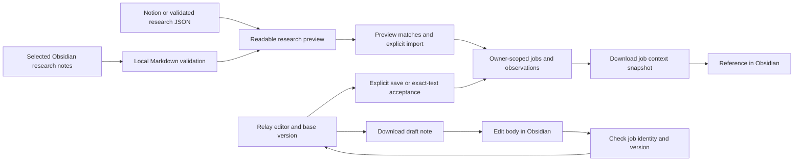

# Relay architecture

Relay is a review workspace for job research and drafts. It stores opportunity history and records approval of exact text. Discovery, note writing, external AI generation and submission remain separate activities. SyberLabs maintains the application.

## Runtime and persistence

The React interface runs through Vinext. The server runs on Cloudflare Workers with D1 persistence. `app/chatgpt-auth.ts` resolves the identity supplied by the trusted Sites authentication gateway. `/api/workspace` scopes reads and mutations to that owner. The local development sign-in is simulated and must not be exposed publicly.

`jobs` stores canonical posting identity, status, draft, accepted text, blockers and version. `observations` preserves imported source records and revisions. `events` records workspace review actions. Database declarations are in `db/schema.ts`; ordered SQL migrations are in `drizzle/`. Obsidian adds no tables or migrations.

The application has no server-side access to a local Obsidian vault and requires no new provider credentials for Markdown handoffs. The repository's `.openai/hosting.json` declares logical storage bindings only; publishing to GitHub does not create a hosted Relay service.

## Data flow

## Responsibility and approval rules

Obsidian research notes own their editable source text. Relay owns the imported observations, application status and acceptance record. A downloaded context file is a dated reference copy, never a second live status authority.

`lib/domain.ts` validates imported rows and canonicalizes job URLs. Known Greenhouse aliases match; tracking parameters are removed from other posting identities. Different job-board URLs are not universally deduplicated. An Obsidian note uses `obsidian:<relay_id>` for source identity and its posting URL for job identity. Duplicate observation identity also includes owner, job, name, source status and note text; edited notes retain earlier observations.

All Obsidian research rows enter with source status Held regardless of status-like properties. Existing job status, draft and exact acceptance are preserved by the established import rules. New jobs start Held. Existing import operations advance job versions, so reimported research can invalidate an outstanding draft packet even when no new observation is created.

Draft imports stage proposed text, without persisting or accepting it. `lib/editor.ts` binds an editor to its loaded job version and session and rejects late file results after selection, session, version or draft changes. Server writes use version checks; stale writes return a conflict. Changing accepted wording requires another explicit review. Submitted and Live loop records allow follow-up edits without resetting their status. Nothing in this flow submits applications or sends messages.

## Obsidian module boundaries

`lib/obsidian.ts` parses bounded YAML properties using the declared `yaml` dependency and handles three file kinds:

- `research` (or no kind for earlier notes) converts a selected Markdown body to a validated source row. It supplies templates for role research, interviews and follow-up planning. Batch conversion rejects duplicate source IDs and returns no partial batch.
- `draft` carries the Relay job ID, canonical key, posting URL and editor version. Its body converts to `relay.draft.v1` with review required. Empty or oversized drafts and inconsistent identity are rejected.
- `snapshot` exports visible job context and that job's observations for reference. It cannot be imported, preventing recursively duplicated research history. It excludes verified-facts input and review events and is not a full backup.

`lib/integration-files.ts` shares the browser and command file-loading contract. It bounds file count and aggregate size before reading, supports Markdown research batches or a single draft/JSON result, and validates draft results against the selected editor target. Linked notes, embeds, directories and attachments are never traversed.

`app/connections.tsx` owns file selection and downloads. It captures the editor target before asynchronous reads and hands validated research to the preview form or proposed text to the guarded editor callback. `app/workspace.tsx` renders readable research and requires a preview of the current import data before enabling its import action. The server validates and classifies again at import time. This UI preview gate is not an API authorization mechanism; authenticated callers can invoke the existing validated import endpoint directly.

`integrations/relay.mjs` exposes `obsidian-pull` and `obsidian-draft` alongside existing Notion, Claude and Grok Bot commands. It reads only named input files, writes with exclusive creation, and makes no network calls for Obsidian. Normal YAML values are parsed, not executed. Note content is untrusted evidence and never changes application instructions or grants approval.

## Failure handling and verification

Invalid research files fail before staging the selection; imports remain subject to server validation and transactional database batches. Duplicate note IDs within one selection are errors. Snapshot imports fail with recovery guidance. Old draft notes require a fresh export and manual carry-forward of edits, not changing their version number. Research-file conversion does not claim that content is factually verified.

The test suite covers domain validation, actual SQLite import statements and migrations, observation deduplication, editor concurrency, mocked external providers, Obsidian conversion and local command round trips. Local API tests exercise authenticated preview/import/read-back and draft/status safeguards with fictional records. Type checks, lint and the production build verify the integration compiles with the app. Installed Obsidian interaction, mobile behavior and Sync remain unverified.

See [Obsidian workflows](integrations/OBSIDIAN.md) for setup, properties, limits and recovery, and [integration setup](integrations/README.md) for the other connectors. Automatic vault watching, two-way status synchronization, a custom Obsidian plugin and linked-note traversal are outside the implemented boundary.
