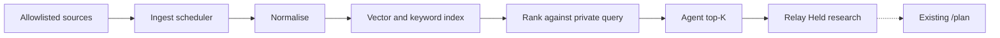

# Discovery plane — ingest, index, agent triage (design)

Design only. This document describes a secondary **job discovery plane**: allowed ingest → normalise → embed/index → rank → agent triage into Relay Held. It does not implement ingest, ranking, or triage.

Relay already reviews research and records exact draft decisions. Today's agent web search can find some postings, but recall is query-shaped: roles that were never retrieved never enter `/plan`. The discovery plane exists to enlarge the opportunity set from sources that permit automated read access. It is not an autonomous apply sender, not a replacement for Hunt's apply rail, and not a place to store applicant records.

Examples in this document are fictional: ExampleCo careers, Acme ATS, FakeBoard RSS. Do not add real employer names from private probes, Greenhouse or other ATS identifiers from personal Hunt data, applicant names, emails, addresses, or questionnaire answers.

## Problem

Agent web search is useful and still recall-limited. A query returns whatever the search index already associated with those words. Many public postings never become visible because they live on a company career sitemap, an ATS board that was not queried, or a feed the agent never opened. Ranking quality cannot recover a role that never entered the set.

`/plan` maximises the expected value of the best single offer, not the sum over applications. That quantity, E[v], is bounded by the opportunity set. A small, query-shaped pool understates the true choice set even when scoring inside the pool is correct. The user problem is missing allowed postings, not a missing Submit button.

The existing read plane (`board-pull` for public Greenhouse and Lever boards) is an explicit, user-run pull of one board into a file. It does not schedule change detection, embed a corpus, or rank against a profile. Discovery volume beyond that pull and beyond ad-hoc agent search needs a separate, allowlisted ingest and index.

## Goals

- Continuously ingest postings from a governed allowlist of sources that permit automated reads: official APIs, RSS/Atom feeds, and company career sitemaps or crawlers that honour robots.txt and the source terms of service.
- Normalise every accepted item onto one job schema so later ranking and Relay import share fields.
- Keep a semantic vector index and a keyword index (BM25 or equivalent) over public posting text.
- Rank candidates against the user's private profile facts, resume-graph tags, and preference weights, plus freshness, geography, and simple filters.
- Have agents consume a short daily top-K, validate each item, and write Held research rows in Relay with the source URL, public evidence, and unknowns. Agents do not Submit.
- Dedupe the same role across URLs using a `canonical_key` and a content hash, then join Relay records with the existing `jobKey` rules when a posting URL is imported.

## Non-goals

- Autonomous apply, form fill, email, or any Submit / write-plane action.
- Bulk scrape of ToS-hostile major job boards as v1. If a source forbids automated access, it is not ingested. Do not advocate or design around illegal scraping, login-wall circumvention, CAPTCHA bypass, or robots.txt evasion.
- Storing private Hunt applicant data, tracker PII, emails, addresses, or questionnaire answers in the discovery index.
- Replacing Hunt as the apply rail. Hunt remains apply; this plane only raises what can later be researched in Relay.
- Replacing `/plan`, preference elicitation, or the citation-gated draft loop.
- Recreating Field_Reports-style probe dumps, raw crawl archives of personal hunts, or any private dump in Git, issues, or this design.
- Granting approval, resetting an active application, or changing Submitted / Live loop / terminal status by rediscovery.

## Architecture layers

Hunt apply and Relay Submit stay off this path. Agents read the ranked shortlist; they are not the crawler.

### Ingest

Sources are allowlisted before the first fetch. Preferred order: official public APIs, then RSS/Atom, then company career sitemaps or documented allowed crawlers. Example shapes, all fictional:

- ExampleCo careers sitemap at `https://careers.exampleco.test/sitemap.xml`, fetched only if robots.txt and the career-site terms allow it.
- Acme ATS public jobs API, using the vendor's documented unauthenticated or partner read endpoint.
- FakeBoard RSS at `https://fakeboard.example/rss/engineering.xml`.

A scheduler fetches each source on an interval suited to that source. Change detection uses cheap signals first: `ETag` / `Last-Modified`, feed `updated` timestamps, and a hash of the listing payload. Unchanged listings skip normalise. Failed fetches are retried with backoff and recorded as source health, not as jobs.

Ingest stores only public posting text and the fetch metadata needed to refresh or delete it. It does not follow arbitrary off-allowlist links, does not log in, and does not collect applicant-facing forms.

### Normalise

Every accepted item becomes one record:

| Field | Purpose |
| --- | --- |
| `url` | Employer or board posting URL used later as Relay import identity |
| `canonical_key` | Stable key for cross-URL dedupe inside the index |
| `company` | Public employer name from the posting |
| `title` | Public role title |
| `location` | Public location or remote label |
| `reqs` | Public requirements / description text |
| `posted_at` | Published or first-seen time |
| `source` | Allowlist id (`exampleco-careers`, `acme-ats`, `fakeboard-rss`) |
| `raw_ref` | Pointer to the ingest artifact (feed item id, API object id), not a private dump |

`canonical_key` may reuse a vendor object id when the API provides one, or a hash of normalised company + title + location + reqs when it does not. URL aliases (tracking parameters, known board host variants) should collapse here so the index does not treat the same ExampleCo listing as two jobs.

Normalise is lossy on purpose: drop application-form fields, recruiter emails, and anything that looks like an applicant answer. Keep the public posting.

### Index

The index holds two views of the same normalised record:

- A vector embedding of title + requirements text for semantic retrieval.
- A keyword document (BM25 or equivalent) for exact skill, title, and location terms.

Dedupe before insert: same `canonical_key` updates in place; a matching content hash is a no-op. Near-duplicates with different keys may still be collapsed later by the agent when evidence shows one role.

The index is a posting corpus, not a user corpus. User resume bodies, fact-ledger claims, and answer banks are never written into it.

### Rank

At query time, build an ephemeral ranking query from private signals that stay outside the crawl store:

- Verified profile facts and resume-graph tags (skill, role, level, domain).
- Preference weights already elicited in `/preferences`.
- Hard filters: geography, remote/on-site, freshness floor, excluded sources.

Score combines semantic similarity, keyword overlap, freshness (stale postings decay, matching the existing freshness prior used in selection), and those filters. Rank explains itself with the signals that moved a row, not with hidden applicant data.

Rank is a retrieval step. It does not accept drafts, verify claims, or decide that a job should be applied to.

### Agent

Once per day, or on an explicit run, take the top-K **new or materially changed** postings that are not already in the owner's workspace. K is small on purpose. Agents then:

1. Open the source URL and check that the posting still exists and matches the indexed text.
2. Write a Held research row in Relay: posting URL, short public evidence (quoted requirements, location, posted date), and unknowns (comp, visa, team) when the posting is silent.
3. Stop. No draft acceptance, no status promotion, no Submit.

Import rules already in Relay still apply: new jobs start Held; matching URLs join the existing opportunity; rediscovery cannot approve text or reopen a terminal outcome. A stale agent packet must not overwrite a newer review.

Agents consume the discovery plane. They do not crawl, expand the allowlist, or fetch off-list sites to "be thorough."

## Data and privacy

Two stores, two audiences:

| Store | Holds | Must not hold |
| --- | --- | --- |
| Discovery index | Public posting text, source id, url, hashes, fetch times | Resume bodies, profile facts, Hunt PII, emails, addresses, questionnaire / Quill answers, private probe dumps |
| Relay workspace | Owner-scoped jobs, observations, drafts, acceptance | Shared crawl corpora, other users' research |

Ranking reads private tags at query time and discards the query when the run ends. It does not merge the fact ledger, style card, or any answer bank into the crawl store. Imports still add evidence only.

Public repository text, issues, and this design may use fictional employers only. Personal Hunt exports, Field_Reports-style dumps, and real board identifiers from private hunts stay out of Git, CI logs, and review comments.

The threat-model rule is unchanged: every Relay read and write belongs to the authenticated user. The discovery index, if shared across users, contains only public postings. Per-user rank state and Held writes remain owner-scoped.

## MVP

Defer a massive web crawl. Ship a narrow, measurable slice:

1. Allowlist a small N of company career pages that permit automated reads, and/or one or two ATS public APIs (the fictional shape is ExampleCo careers plus Acme ATS).
2. Schedule fetch + change detection.
3. Normalise onto the schema above.
4. Embed and index.
5. Rank with a first-pass query from profile / resume-graph tags and existing preference weights.
6. Daily agent top-K into Relay Held, with source URL and evidence.

Measure unique normalised jobs per day, the share of top-K the agent keeps as Held, and later whether a kept row is linked to an interview or other receipted outcome. Those numbers describe the plane; they do not prove product-market fit.

Existing `board-pull` remains the explicit one-board import path. MVP may reuse its public-board parsers for allowlisted ATS hosts; it does not turn every public board into a background crawl.

## Fit with Relay, Hunt, and resume-graph

- **Relay** owns review, exact acceptance, and history. Discovery feeds Held research. It does not stage drafts, accept text, or submit.
- **Resume-graph tags** (structured skill, role, and domain labels derived from the user's private resume graph) improve rank. The graph and the resume body stay private. Tags are query features, not index documents.
- **Hunt** remains the apply rail. This plane does not replace Hunt's apply flow, store Hunt applicant records, or import Hunt PII into the index.
- **`/plan` and preferences** still choose among jobs already in the workspace. A larger Held set can change E[v] only after triage; rank in the discovery plane is not a second planner.
- **Agents** are consumers of the secondary layer. The crawler/scheduler is a bounded ingest job. Mixing those roles invites off-allowlist fetching and unreviewed volume.

## Risks

- **Terms and robots.** An allowlisted source can change terms. Ingest must stop when permission is withdrawn, not continue on a cached interpretation.
- **Staleness.** Filled or withdrawn roles linger. Change detection and agent URL checks are the control; rank freshness is not enough.
- **Infra cost.** Embeddings and periodic fetches grow with the allowlist. MVP stays narrow so cost is visible before expansion.
- **Spam and garbage.** Feed noise and SEO postings will rank. Agent validation and a sharp K are the filter; do not compensate by raising K.
- **Agent overload.** A large K recreates the unread-draft problem: a reviewer facing forty new Held rows stops reviewing. Cap K to work the owner will actually look at.
- **Identity collisions.** Imperfect `canonical_key` values can merge distinct roles or split one role. Prefer under-merge plus agent notes over silent over-merge.
- **Prompt injection from postings.** Requirements text is untrusted. Agents treat it as evidence to quote, never as instructions.

## Open questions

- **Allowlist governance.** Who adds a source, what evidence of API/RSS/robots permission is required, and how a source is removed when terms change.
- **Embedding model.** Which model embeds posting text, whether it runs locally, and how a model change is reindexed without mixing vectors.
- **Rank placement.** Whether rank runs on-box against a local index or as a service that receives an ephemeral query and returns ids. The crawl store must not receive resume text in either case.
- **Retention TTL.** How long a posting stays after it disappears from the source, and whether withdrawn URLs are deleted or marked gone for change detection.
- **Join with `jobKey`.** How index `canonical_key` maps onto Relay's existing URL canonicalisation when the same role appears on ExampleCo careers and an Acme ATS host.

This document does not choose those defaults. Implementation work should answer them in an issue with acceptance criteria before ingest ships.
