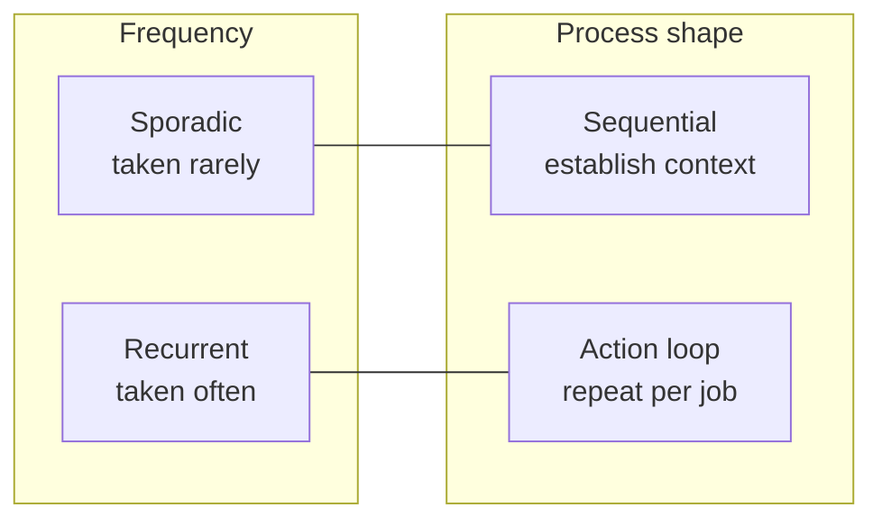
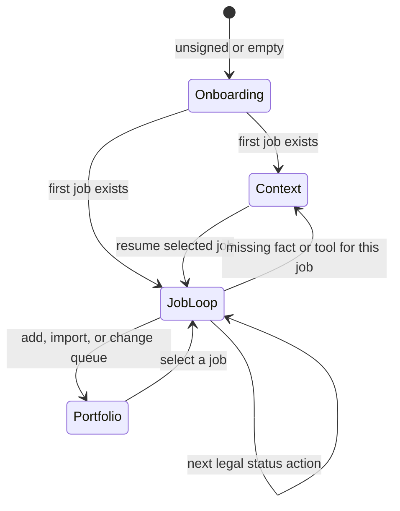

# Workspace interaction stages

**Issue:** [#103](https://github.com/SyberLabs/relay/issues/103)
**Date:** 2026-09-07
**Decision owner:** Seth Carlson
**Research partner:** Mateo Robles

## Problem

Relay currently presents a **generic dashboard**: job-list filters, add/import, Your facts, Track outcomes, Advanced, the selected-job editor, posting-fit labels, and assistant handoff all appear as peer capabilities. A returning person has to reconstruct what they came to do. Rare setup and frequent job work compete for the same attention.

That is a user-model problem, not a missing widget. The product already has a job-status machine (`Held` → `Ready` → `Submitted` → `Live loop` → recorded outcomes). The chrome does not treat that machine as the home of recurrent work. Setup-shaped language (“connect your tools”) sits on the recurrent handoff. Loop-shaped chrome (nine queue filters, Advanced planning) sits beside the first draft. The person is not told which **stage** they are in, so every action looks equally available.

Product-market fit remains unvalidated until people return on their own ([issue #5](https://github.com/SyberLabs/relay/issues/5)). A clearer stage model is a hypothesis about that return: they come back to continue a **job action loop**, not to re-read a dashboard.

## Decision

Classify every user action on **two axes**, then place it in a **stage**. States already exist; stages group those states and name the legal actions inside them.

Do **A**. Never **B** or **C** from this document.

- **A (this issue):** Write the interaction contract below. Later UI work needs its own issue and must cite this mapping. No layout or routing change ships from this spec.
- **B (deleted):** A linear wizard that forces facts, preferences, and integrations before the first job. Context establishment is optional; it must not block the loop.
- **C (deleted):** A generic workflow engine, new job statuses, or a redesigned shell that “looks like a product.” Adjacent-panel mapping (controls next to the thing they change) is a separate concern and is not this model.

Who owns “what should I do now?” The product, by exposing the legal action for the current stage and state. Who owns sending an application? The user. Relay remains a research and review product.

## Two axes

| Axis | Meaning | Failure if ignored |
| --- | --- | --- |
| **Frequency** | How often a signed-in person should need this action across a week of real applications | Rare actions occupy the home screen; frequent actions hide behind setup language |
| **Process shape** | Whether the work is a one-way establishment sequence or a repeatable loop on a job | Sequential work is presented as a dashboard of toggles; loop work is presented as a form to fill once |

These axes are not independent. Sequential work is usually sporadic after the first pass. Loop work is recurrent. Mixed cells exist and must be named, not averaged into “also show a button.”

|  | Sequential (establish) | Action loop (repeat) |
| --- | --- | --- |
| **Sporadic** | Sign-in, first job, first confirmed facts, preference fitting, bulk tracker import, Advanced planning | Recording a terminal outcome, reopening nothing (ended jobs stay ended) |
| **Recurrent** | Updating a fact when a new posting requires it | Select job → research → draft → exact accept → handoff → return → save → submit with receipt |

The important mixed cell is **recurrent sequential**: “I need one more verified fact for this posting.” That is a short excursion from the job loop into context, then back. It is not a return to a dashboard.

## Stages own states

A **stage** is a named partition of the existing state space. An **action** is legal only in the stages listed for it. Chrome for other stages may exist, but it is not the primary path.

| Stage | What it is for | Existing states that belong here | Primary surface today |
| --- | --- | --- | --- |
| **Onboarding** | Become a person with at least one job | Signed out; signed in with zero jobs | Sign-in; empty workspace `FirstJob` |
| **Context establishment** | Make reusable evidence available | Profile facts (none / proposed / verified / expired); preference weights unset; no assistant packet habit | `/profile`, `/preferences`, import dock, Advanced |
| **Job action loop** | Move **one** selected job through review without losing exact text | Job `Held`, `Ready`, `Submitted`, `Live loop`; editor clean / dirty / conflict | Workspace editor, Connections handoff, source history |
| **Portfolio** | Choose which job is next | Queue filter; `Skip`; counts; add-another-job | Job list filters; Add job; Import research |

Rules:

1. **Onboarding is the only sequential gate.** Zero jobs means the next action is add or import one job. After that, the home stage is the job loop.
2. **Context is optional.** A person may draft and accept without verified facts. Missing facts make posting-fit lines `unknown`; they do not freeze the loop. Requiring a complete ledger before `Held` would invent a wizard this product does not own.
3. **The selected job’s status picks the loop step.** `Held` is research and draft. `Ready` is retrieve accepted wording. `Submitted` / `Live loop` is notes without resetting status. Terminal outcomes (`Offer`, `Accepted`, `Closed`) leave the application loop; remaining work is record-keeping.
4. **Portfolio is between loops, not inside a draft.** Changing the queue filter or adding a job is legal while an editor is clean. A dirty editor already asks before navigation; that protection stays.
5. **Handoff is loop, not setup.** Preparing a packet and returning a draft is recurrent per job. Labeling it as connecting tools mis-stages the action.

## Legal actions

Each row is an existing capability. “Stage” is where it is primary. Other stages may link to it; they must not present it as the current job’s next step.

| Action | Frequency | Shape | Stage | Legal when |
| --- | --- | --- | --- | --- |
| Sign in | Sporadic | Sequential | Onboarding | Unsigned |
| Add first job (title, HTTPS URL, optional notes) | Sporadic | Sequential | Onboarding | Zero jobs, or empty-state add. A first import that creates the first job also completes onboarding. |
| Add another job | Recurrent | Portfolio | Portfolio | At least one job; editor not dirty or confirmed leave |
| Import tracker CSV / research JSON | Sporadic (bulk) | Sequential | Portfolio | Signed in; preview before save. First import may finish onboarding. Later imports are between loops. Import never grants acceptance. |
| Confirm or update a profile fact | Sporadic, sometimes a loop excursion | Sequential | Context | Signed in; confirmation is the user’s, not Relay’s |
| Fit preferences / weekly plan | Sporadic | Sequential | Context | Advanced; experimental; not offer probability |
| Select a job in the current queue | Recurrent | Portfolio | Portfolio | Signed in with jobs. Selection enters the job loop. |
| Edit draft and blocker | Recurrent | Loop | Job loop | Selected non-conflict editor; version matches on save |
| Accept exact wording (`Ready`) | Recurrent | Loop | Job loop | `Held` (or editable non-terminal); exact text; empty blocker |
| Assistant packet out / draft back | Recurrent | Loop | Job loop | A selected job with identity and version |
| Save notes on `Submitted` / `Live loop` | Recurrent | Loop | Job loop | Status stays; no silent reset |
| Record submission with receipt | Recurrent | Loop | Job loop | `Ready` (or allowed transition); receipt required |
| Open Track outcomes | Recurrent across jobs | Portfolio | Portfolio | Signed in; `/track` is not the `Held` home |
| Record a terminal outcome | Sporadic per job | Loop then stop | Job loop | Ended jobs cannot be resurrected by import |
| Set aside (`Skip`) | Recurrent | Portfolio | Portfolio | Non-terminal; human action, not auto-skip on fit miss |
| Open Advanced batch review | Sporadic | Sequential | Context | Must not accept or send |

Illegal crossings this model forbids as **primary** paths (they may remain reachable):

- Treating Advanced planning as a home-screen step for a `Held` draft.
- Treating bulk import as the way to “start applying.”
- Treating fact confirmation as a prerequisite to add a job.
- Treating assistant handoff as account setup.
- Using import or rediscovery to grant `Ready` or reopen a closed job.

## Approaches considered

1. **Keep the dashboard; add a checklist.** Cheap. Leaves every control equally loud. The person still hunts. Rejected as the target model.
2. **Onboarding wizard (facts → preferences → integrations → first job).** Looks sequential. Blocks the only action that creates a job record. Conflicts with “imports add evidence; they cannot grant approval” by implying setup completeness is progress. Rejected.
3. **Stage-owned primary action (chosen).** Home is the legal next action for the selected job’s state. Onboarding only when empty. Context and portfolio are named exits from the loop, not siblings of Accept. No new statuses. No new tables.
4. **Software state-machine router for every click.** Would duplicate `lib/domain.ts` and editor session rules in the shell. Premature. If a later UI slice needs a small helper (`primaryAction(stage, job, editor)`), it derives from existing records; it does not become a workflow product.

## What later implementation may do

A follow-up issue may:

- Name the current stage in copy for empty workspace vs selected job (without a marketing manifesto).
- Make the selected job’s legal action the primary control, and move add/import/facts/advanced to secondary entry points.
- Keep packet/handoff with the selected job (loop), not in a global “integrations” dashboard.
- Keep queue filters as portfolio navigation, not as the visual equal of Accept.

That issue must preserve: exact versioned acceptance; stale-editor and stale-viewer refusals; import preview; owner isolation; gateway, CAPTCHA, quotas, bounded work; current public positioning until behavior actually changes.

## What this document does not do

- Change `app/` routing, shell layout, or copy.
- Add schema, statuses, or telemetry.
- Authorize bulk send, auto-accept, or background assistant calls.
- Replace [pilot throughput](../../pilot-throughput.md) measurement or issue #5 retention criteria.
- Claim that staging the UI will increase applications or hiring outcomes.

## Contracts preserved

- Every database read and write belongs to the authenticated user.
- Accepted text is exact and versioned. Changing it requires fresh acceptance.
- Imports add evidence; they cannot grant approval or reset an active application.
- A stale editor or assistant packet must not overwrite newer work.
- This is not an autonomous application sender.
- Abuse and cost controls remain release requirements for any later UI change.

## Testing when a UI slice exists

Not in this issue. A later slice needs tests that:

- Empty workspace still adds one job without visiting Profile.
- A `Held` job’s primary control is review/accept or handoff, not Advanced.
- Dirty editor still blocks silent navigation into portfolio/context.
- Import still cannot set `Ready` or reopen a closed job.
- Existing account-switch, 401, and isolation suites still pass.

Until then, this file is the reviewable contract. Rollback is deleting or amending the spec through the same review path.
